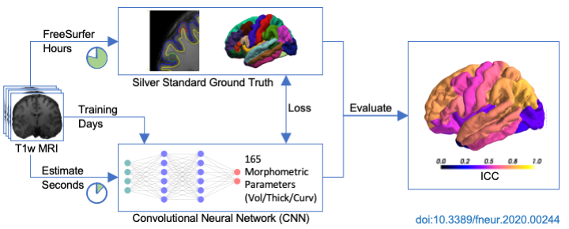

# About Brain Regressor CNN


A deep learning-based method to estimate brain morphometry directly from T1-weighted MRI.



The code is related to the following publication [publication](https://doi.org/10.3389/fneur.2020.00244) ([bibtex](doc/cite.bib)):
```
Rebsamen, M., Suter, Y., Wiest, R., Reyes, M., & Rummel, C. (2020)
Brain morphometry estimation: From hours to seconds using deep learning.
Frontiers in Neurology, 11, 244. https://doi.org/10.3389/fneur.2020.00244
```

# Quick start in three steps:
## Create virtual environment (optional)
```bash
conda create -n DL python=3.6
source activate DL
pip install -r Python/requirements.txt
```

## Import FreeSurfer data into h5 dataset
Assuming FS_RESULTS_DIR points to subjects directory with FreeSurfer results (GT) to import.
```bash
cd Python
./create_ds.sh FS_RESULTS_DIR
```

## Train model
```bash
export PYTHONPATH=../miapy:../Python
python main.py config.json 
```
